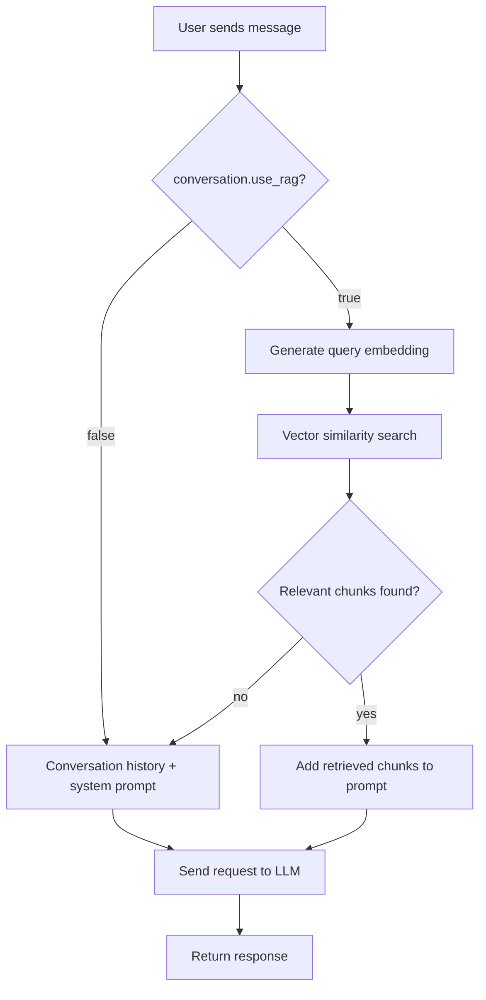
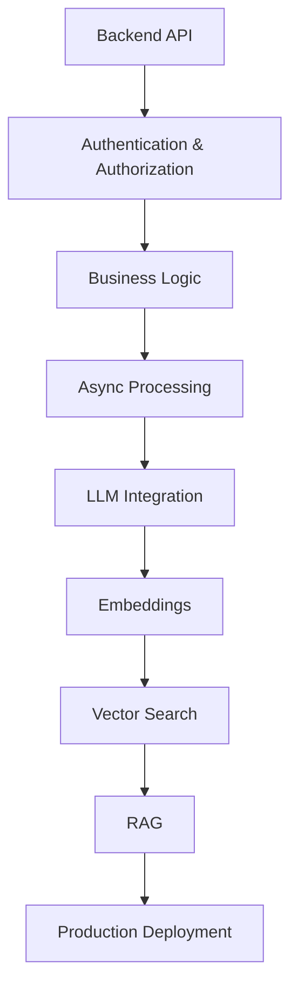

# shion-AI


A backend platform for creating and managing personalized AI assistants with conversational memory and RAG-based document retrieval.

Built as a portfolio project to demonstrate production-oriented backend engineering, asynchronous processing, LLM integration, and retrieval-augmented generation.

**Live Demo:** https://shion-ai-production.up.railway.app  
**Interactive API Documentation:** https://shion-ai-production.up.railway.app/docs

---

## Project Status

The MVP is complete and deployed.

- ✅ Authentication and authorization
- ✅ Multi-user AI assistants
- ✅ Conversational history
- ✅ LLM integration with retry and error handling
- ✅ Rate limiting
- ✅ Document ingestion and processing
- ✅ Embeddings and vector search with `pgvector`
- ✅ RAG-based responses
- ✅ Background document processing with Celery
- ✅ Redis-based infrastructure
- ✅ Integration with Google Gemini for chat and embeddings
- ✅ Integration and testing against real PostgreSQL + pgvector
- ✅ CI with GitHub Actions
- ✅ Production deployment on Railway

Detailed development history:

- [`SEMANA_1.md`](./SEMANA_1.md)
- [`SEMANA_2.md`](./SEMANA_2.md)
- [`SEMANA_3.md`](./SEMANA_3.md)
- [`SEMANA_4.md`](./SEMANA_4.md)
- [`SEMANA_5.md`](./SEMANA_5.md)

AI concepts explained from first principles:

- [`CONCEPTOS_IA.md`](./CONCEPTOS_IA.md)

---

## Key Engineering Decisions

The following decisions are the most relevant parts of the project from an engineering perspective.

### LLM provider decoupling

The project was migrated from OpenRouter to the Google Gemini API without changing the conversation business logic.

The provider-specific implementation is isolated from the application domain, allowing the underlying LLM provider to be replaced without rewriting the core conversation flow.

This was intentionally implemented without introducing a large abstraction framework.

See [`SEMANA_4.md`](./SEMANA_4.md) for the full reasoning.

### Idempotent document processing

Document processing is designed to be idempotent.

Retrying the same Celery task does not create duplicate document chunks.

This issue was identified and fixed before production deployment rather than after encountering a production incident.

See [`SEMANA_5.md`](./SEMANA_5.md).

### Critical architectural review

An external architectural review was analyzed rather than applied blindly.

Of the 10 recommendations:

- 4 were accepted
- 4 were rejected with explicit reasoning and criteria for reconsideration
- 2 were partially accepted

The objective was to distinguish between genuinely useful architectural improvements and unnecessary complexity for the current scale of the project.

See [`SEMANA_5.md`](./SEMANA_5.md) for the complete reasoning.

### RAG with explicit safeguards

The RAG pipeline does not blindly inject the closest retrieved documents into the prompt.

It includes:

- A configurable relevance threshold
- A per-conversation RAG toggle
- File size limits
- Tenant/assistant-level document isolation

These safeguards were introduced after identifying specific failure modes rather than as a generic feature checklist.

---

## Architecture

### High-level RAG flow


Documents are uploaded and processed asynchronously:

```text
Upload
  ↓
Document validation
  ↓
Text extraction
  ↓
Chunking
  ↓
Embedding generation
  ↓
Vector storage
  ↓
Available for RAG
```

The complete implementation and development decisions are documented in `SEMANA_3.md` and `SEMANA_4.md`.

## Tech Stack

### Backend
*   **FastAPI** — async REST API
*   **SQLAlchemy 2.0** — async ORM
*   **Pydantic** — request/response validation
*   **PostgreSQL** — relational data storage
*   **pgvector** — vector similarity search
*   **Alembic** — database migrations

### AI / LLM
*   **Google Gemini API** via `google-genai`
    *   `gemini-3-flash-preview` — conversational responses
    *   `gemini-embedding-001` — document and query embeddings
*   RAG pipeline with vector similarity search

### Background Processing
*   **Celery** — asynchronous document processing
*   **Redis** — Celery broker, JWT blacklist, and rate limiter storage

### Infrastructure
*   **Docker**
*   **Docker Compose**
*   **Railway**

### Observability / Security
*   **structlog** — structured JSON logging
*   Request correlation through `contextvars`
*   JWT authentication
*   Token blacklist
*   Rate limiting with `slowapi`

### Testing / CI
*   **pytest**
*   **pytest-asyncio**
*   Integration tests against real PostgreSQL + pgvector
*   **GitHub Actions**
    *   PostgreSQL and Redis service containers
    *   Coverage threshold of 70%

### Document Processing
*   **pypdf** — PDF text extraction

---

## Project Structure

```text
shion-AI/
├── src/app/
│   ├── api/            # API routers
│   ├── core/           # Configuration, security, infrastructure
│   ├── db/             # Database configuration and sessions
│   ├── models/         # SQLAlchemy models
│   ├── schemas/        # Pydantic schemas
│   ├── services/       # Domain and business logic
│   ├── tasks/          # Celery background tasks
│   └── tests/          # Async test suite
├── alembic/            # Database migrations
├── scripts/            # Container entrypoint
├── docker-compose.yml
├── Dockerfile
└── pyproject.toml
```

The application logic is organized primarily around domain services rather than putting business logic directly inside API routers.

---

## Getting Started

### Requirements
* Docker and Docker Compose
* Python 3.12+ if running the API outside Docker
* A Google AI Studio API key for `GEMINI_API_KEY`

### 1. Clone the Repository
```bash
git clone https://github.com/thomacev/shion-AI.git
cd shion-AI

```

### 2. Configure Environment Variables

Copy the example environment file:

```bash
cp .env.example .env

```

Configure the required values, including the Gemini API key and database/Redis settings.

### 3. Start the Application

```bash
docker compose up -d --build

```

This starts:

* PostgreSQL with pgvector
* Redis
* FastAPI
* Celery worker

Database migrations are applied automatically by the API container.

The API will be available at:

* `http://localhost:8000`

Interactive API documentation:

* `http://localhost:8000/docs`

---

## Testing

The test suite uses a real PostgreSQL database with pgvector rather than SQLite.
Database tests are isolated through transactions with automatic rollback.
External LLM and embedding calls are mocked, while document processing is tested independently from the Celery execution layer.
The test suite therefore does not require a running Celery worker or access to the real Gemini API.

```bash
docker compose up -d db redis
pytest --cov=app --cov-report=term-missing

```

---

## Continuous Integration

Every push runs the GitHub Actions CI pipeline.
The pipeline starts PostgreSQL with pgvector and Redis as service containers, applies database migrations, and executes the complete test suite.
A minimum coverage threshold of 70% is enforced.

See: `.github/workflows/ci.yml`

---

## Deployment

The application is deployed on Railway.
The production environment consists of:

* FastAPI application
* PostgreSQL
* Redis
* Dedicated Celery worker

The Celery worker is required for asynchronous document processing.
Production configuration is managed through environment variables rather than committed configuration files.

---

## Known Limitations

### Conversation Memory

Conversation history is currently limited to the latest 20 messages.
There is no long-term summarized memory mechanism yet.

### Scanned PDFs

PDF extraction currently relies on `pypdf`.
Scanned PDFs without a selectable text layer are therefore not handled through OCR. `pymupdf4llm` was evaluated as a possible alternative, but was not adopted due to its AGPL license and the current scope of the project.
See `SEMANA_4.md` for the reasoning.

### RAG Relevance Threshold

`RAG_MAX_DISTANCE` is currently an initial threshold rather than a value calibrated against a production evaluation dataset.
A future improvement would be to build an evaluation dataset and tune the retrieval threshold against measurable retrieval quality.

### No Frontend

There is currently no frontend application.
The system is intentionally exposed through the REST API and interactive Swagger documentation because the primary goal of the project is backend engineering rather than frontend development.

---

## Documentation

The development process is documented chronologically:

| Document | Focus |
| --- | --- |
| `SEMANA_1.md` | Project foundation, authentication, assistants, conversations, testing and CI |
| `SEMANA_2.md` | LLM integration, retries, error handling and rate limiting |
| `SEMANA_3.md` | Document ingestion, chunking, embeddings and vector search |
| `SEMANA_4.md` | Celery, background processing and Gemini migration |
| `SEMANA_5.md` | Architectural review, resilience, safeguards and production deployment |
| `CONCEPTOS_IA.md` | AI concepts learned while building the system |

---

## Project Goals

`shion-AI` is primarily a learning and portfolio project focused on combining backend engineering with practical Generative AI systems.
The main goal is not to hide the complexity behind an AI framework, but to understand and implement the underlying components:



The project will continue evolving as new requirements, architectural problems, and AI engineering concepts are explored.
